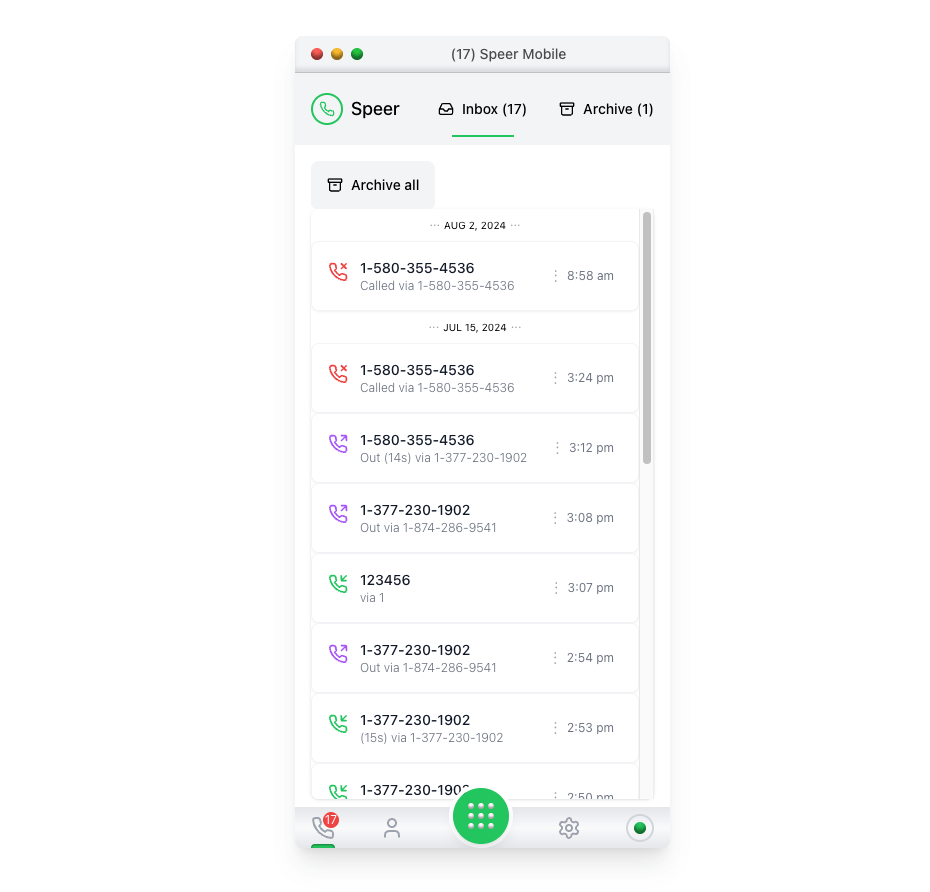

# Speer Mobile App Exercise / Tyson Skakun

- **Deployment Link**: [Link to live app](https://speer-skakun.vercel.app/)



## Summary
The goal of this project was to create a small ReactJS application with the following features:

- **Activity Feed**: Displays a list of calls.
- **Activity Detail**: Shows detailed information about a specific call.
- **Archive**: Users can archive and unarchive calls. Archived calls are moved to a separate Archived Tab.
- **Archive/Unarchive All**: Buttons to archive or unarchive all calls in the activity feed or the archived calls tab.

### Features:
1. View all activity feed calls.
2. View detailed information of each call.
3. Archive and unarchive calls.
4. Archive or unarchive all calls with a single button click.
5. Clear and user-friendly UI with transitions and proper design sense.

### Additional Features:
1. Individual calls can be archived or unarchived by clicking on the archive icon.
2. Loading screen that runs if server is being spun up.
3. Conditional rendering and animations for the archive and unarchive buttons. Including Motion transitions, and messages that show when lists are empty
4. Smooth slide of green tab indicator for switch between inbox and archive tabs.
5. Home Button Easter Egg, random Heart emojies fade in and out when clicked.
6. Inbox number is carried through ui from header to icon phone icon in footer

### Technologies Used:
- **ReactJS**: Frontend library for building user interfaces.
- **TailwindCSS**: Utility-first CSS framework for styling.
- **Framer Motion**: Animation library for React.

---

## Installation

To get started with the app, follow the steps below:

1. **Clone the Repository:**
   ```bash
   git clone https://github.com/DRIZZTAR/fa0fd060 <your-project-name>
    ```
2. **Change Directory:**
    ```bash
    cd <your-project-name>
    ```
3. **Install Required Dependencies:**
    ```bash
    npm install
    ```
4. **Start the Development Server:**
    ```bash
    npm start
    ```
5. **Open the Browser and Navigate to:**
    ```bash
    http://localhost:5173
    ```

---
